<div align="center">

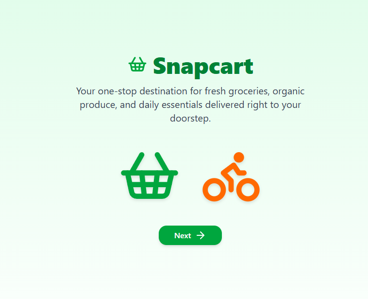

<br/>
<br/>

<h1>🛒 Snapcart</h1>
<h3>Real-Time Grocery Delivery Platform</h3>

<p>
  A full-stack grocery delivery web application built with <strong>Next.js 14</strong>, featuring<br/>
  role-based dashboards, live GPS tracking, in-app chat, and AI-powered delivery assistance.
</p>

<br/>

<!-- Badges -->


<br/><br/>

[🚀 Live Demo](#) &nbsp;•&nbsp; [📖 Documentation](#) &nbsp;•&nbsp; [🐛 Report Bug](../../issues) &nbsp;•&nbsp; [💡 Request Feature](../../issues)

</div>

---

### 🏠 Homepage & Hero Section

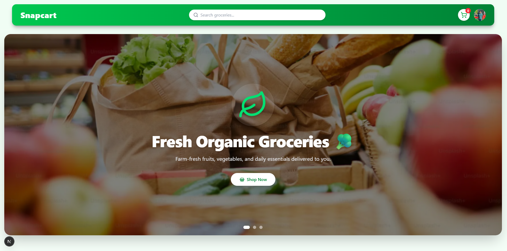

---

### 👤 Customer Dashboard & Grocery Browsing

<table>
  <tr>
    <td >
      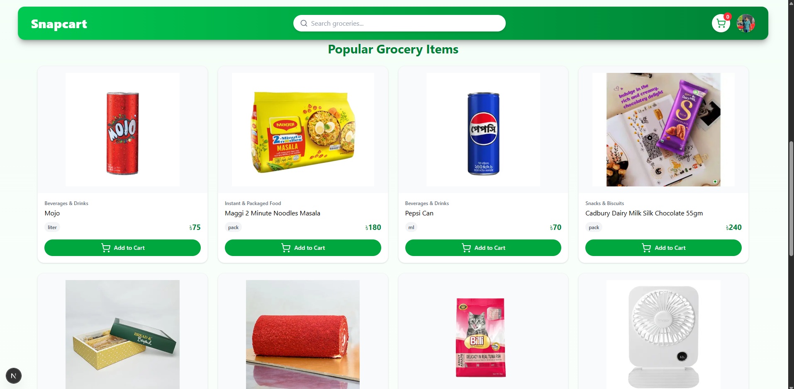
      <p align="center"><em>Browse Groceries by Category</em></p>
    </td>
  </tr>
</table>

---

### 🛒 Cart & Checkout

<table>
  <tr className="flex flex-wrap">
    <td >
      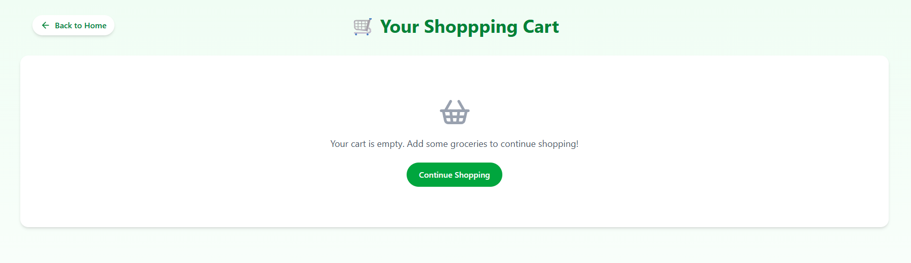
      <p align="center"><em>Shopping Cart with Quantity Controls</em></p>
    </td>
    <td>
      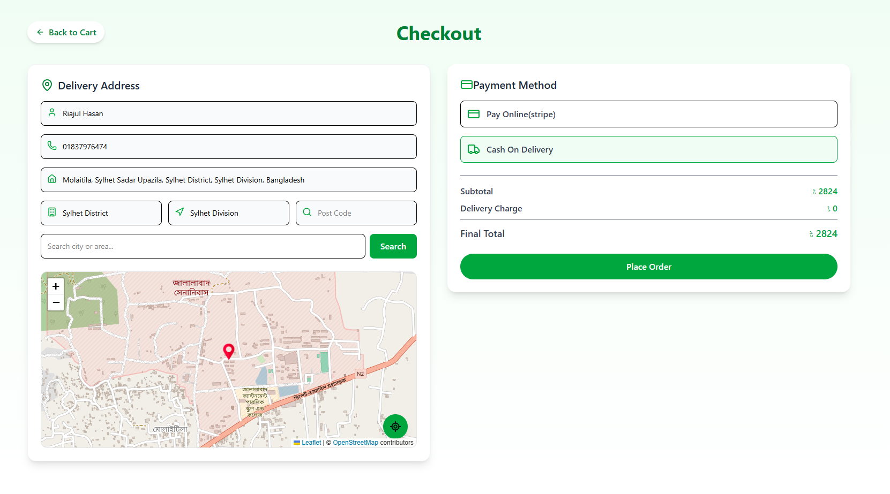
      <p align="center"><em>Checkout with Payment Options</em></p>
    </td>
  </tr>
</table>

---

### 🗺️ Real-Time Order Tracking

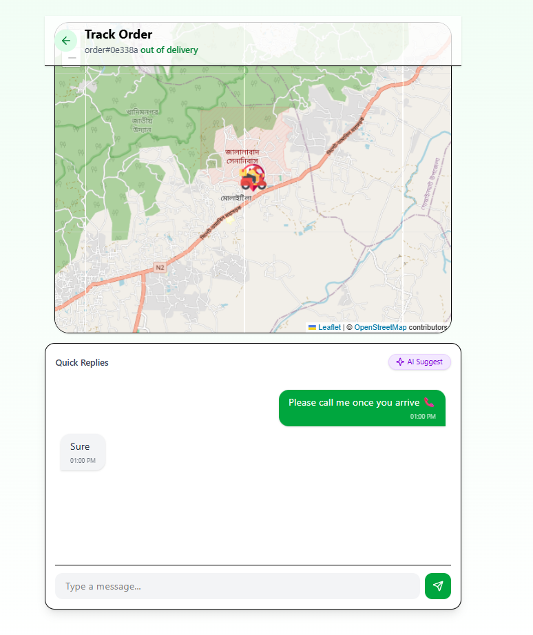
<p align="center"><em>Live GPS Tracking — Delivery Boy & Destination on Interactive Map</em></p>

---

### 🏪 Admin Dashboard

<table>
  <tr>
    <td >
      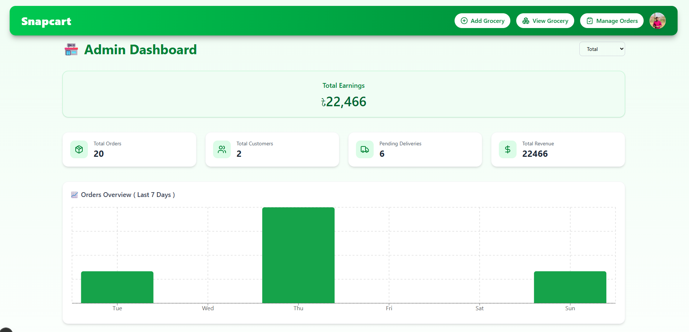
      <p align="center"><em>Admin Dashboard with Revenue Analytics & Charts</em></p>
    </td>
    <td>
      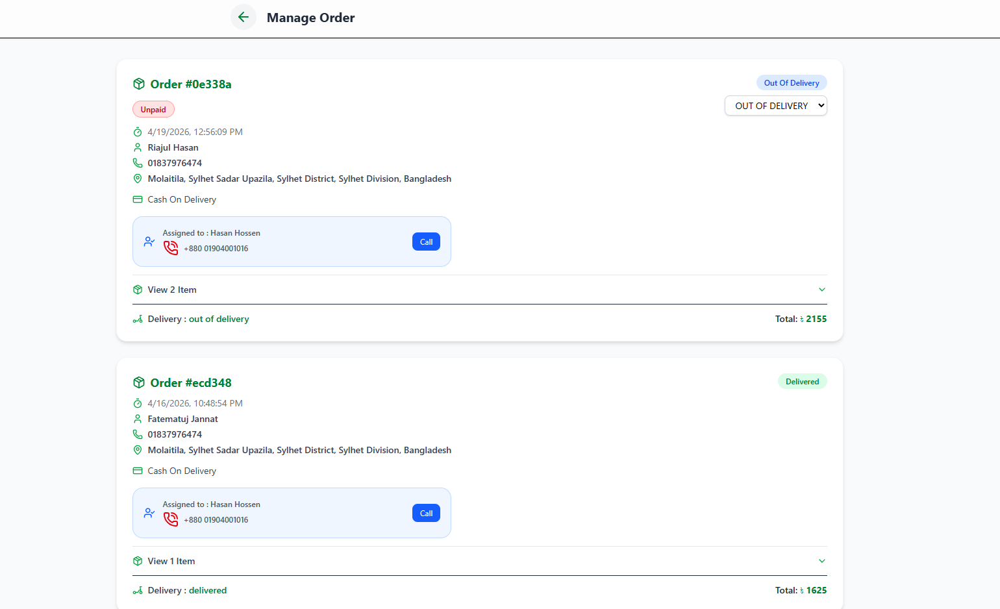
      <p align="center"><em>Order Management Panel</em></p>
    </td>
  <td>
   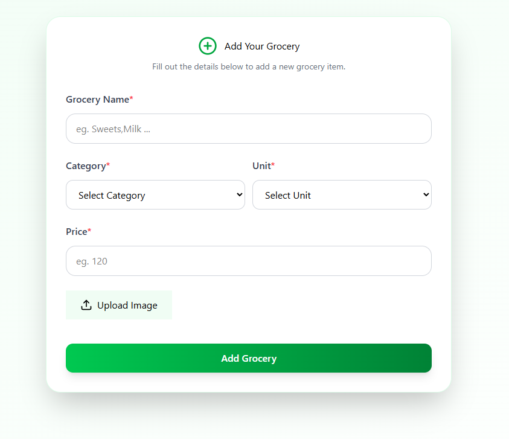
    <p align="center"><em>Add Grocery Management Panel</em></p>
  </td>
  </tr>
</table>

---

### 🛵 Delivery Boy Dashboard

<table>
  <tr>
    <td>
      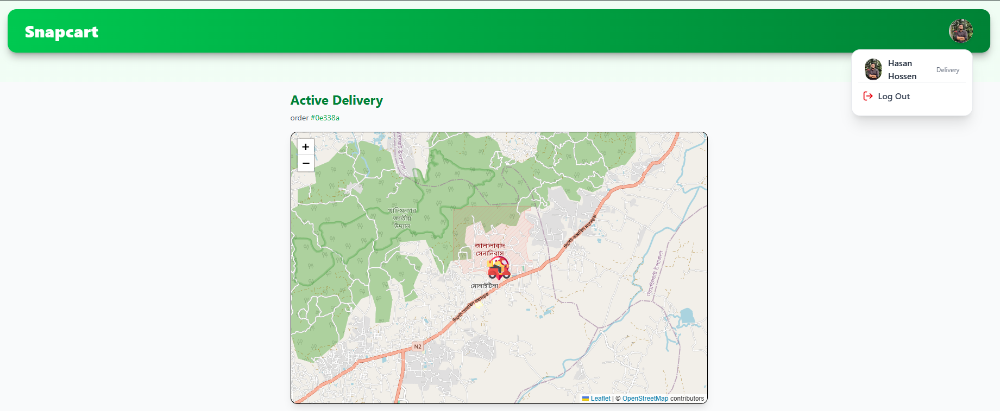
      <p align="center"><em>Delivery Assignment Panel</em></p>
    </td>
    <td >
      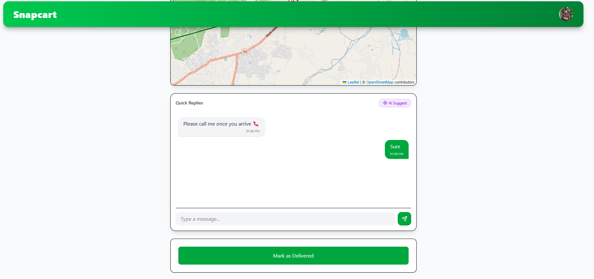
      <p align="center"><em>In-App Chat with AI Reply Suggestions</em></p>
    </td>
    <td >
      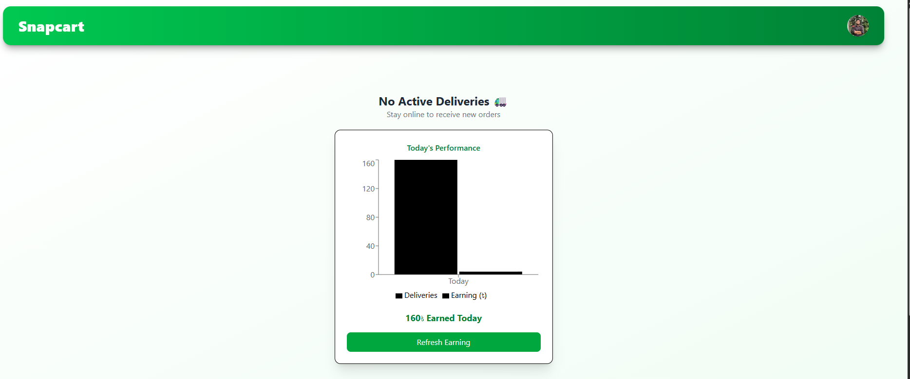
      <p align="center"><em>Delivery Boy Dashboard</em></p>
    </td>
  </tr>
</table>

---

### 🔐 Authentication Pages

<table>
  <tr>
    <td >
      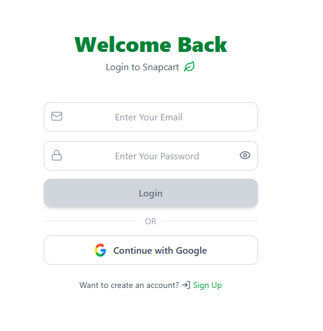
      <p align="center"><em>Login — Email & Google OAuth</em></p>
    </td>
    <td >
      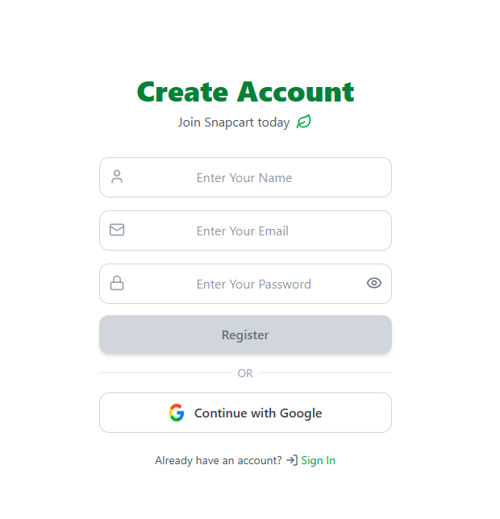
      <p align="center"><em>Register — With Role Selection</em></p>
    </td>
  </tr>
</table>

---

## ✨ Features

<details>
<summary><strong>👤 Customer Features</strong></summary>

- 🛍️ Browse groceries across **10 categories** with an animated category slider
- ➕ Add/remove items from cart with live quantity controls (Redux-managed state)
- 💳 Place orders via **Cash on Delivery** or **Stripe Online Payment**
- 🗺️ Track orders in real-time on an interactive **Live Map** (React Leaflet + OpenStreetMap)
- 💬 **In-app chat** with the assigned delivery boy during active delivery
- 📦 View complete **order history** with statuses
- 📞 View assigned delivery boy's contact details

</details>

<details>
<summary><strong>🏪 Admin Features</strong></summary>

- 📊 Analytics dashboard: **total orders, customers, revenue, pending deliveries**
- 📅 Revenue filter: **Today / Last 7 Days / All Time**
- 📈 Interactive **bar chart** showing order trends over the last 6 days (Recharts)
- ✏️ Full **CRUD** for grocery items (add, edit, delete with Cloudinary image upload)
- 🔄 Update order statuses with **real-time propagation** via Socket.io
- 🚴 View assigned delivery personnel per order

</details>

<details>
<summary><strong>🛵 Delivery Boy Features</strong></summary>

- 📬 Receive & accept **delivery assignments** in real-time via WebSocket
- 📡 Broadcast **live GPS location** to customers and admin continuously
- 💬 Chat with customers, powered by **AI-generated quick reply suggestions**
- 🔒 **OTP-based delivery confirmation** — email OTP sent on arrival, verified to complete delivery
- 🗺️ View delivery address on map with route polyline

</details>

---

## 🧱 Tech Stack

| Layer          | Technology              | Purpose                         |
| -------------- | ----------------------- | ------------------------------- |
| **Framework**  | Next.js 14 (App Router) | SSR, routing, API routes        |
| **Language**   | TypeScript 5            | Type-safe development           |
| **Styling**    | Tailwind CSS 4          | Utility-first responsive design |
| **Animations** | Framer Motion           | Smooth UI transitions           |
| **State**      | Redux Toolkit           | Client-side cart & user state   |
| **Auth**       | NextAuth.js v5          | Sessions, JWT, Google OAuth     |
| **Database**   | MongoDB + Mongoose      | Persistent data storage         |
| **Real-Time**  | Socket.io 4             | WebSocket event handling        |
| **Maps**       | React Leaflet + OSM     | GPS visualization               |
| **Charts**     | Recharts                | Admin analytics                 |
| **Payment**    | Stripe                  | Online card payments            |
| **Images**     | Cloudinary              | CDN image hosting               |
| **Email**      | Nodemailer              | OTP delivery                    |
| **Icons**      | Lucide React            | UI icon set                     |
| **HTTP**       | Axios                   | API communication               |

---

## 🗺️ System Architecture

```
┌─────────────────────────────────────────────────────────┐
│                      CLIENT BROWSER                      │
│   Customer | Admin | Delivery Boy (React + Next.js)      │
└──────────────┬──────────────────────────┬────────────────┘
               │  HTTPS (REST API)         │  WebSocket (WSS)
               ▼                           ▼
┌──────────────────────┐      ┌───────────────────────────┐
│   Next.js App Server  │      │   Socket.io Server         │
│   (Port 3000)         │◄────►│   (Node.js / Express)      │
│   App Router + API    │      │   (Port 4000)              │
└──────────┬───────────┘      └───────────────────────────┘
           │
    ┌──────┼──────────────┐
    ▼      ▼              ▼
┌───────┐ ┌───────────┐ ┌──────────┐
│MongoDB│ │Cloudinary │ │  Stripe  │
│ Atlas │ │   (CDN)   │ │ Payments │
└───────┘ └───────────┘ └──────────┘
```

---

## 📁 Project Structure

```
Grocery_Delivery/
├── src/
│   ├── app/
│   │   ├── api/
│   │   │   ├── auth/                    # NextAuth.js routes
│   │   │   │   ├── [...nextauth]/
│   │   │   │   └── register/
│   │   │   ├── admin/                   # Admin API routes
│   │   │   │   ├── add_grocery/
│   │   │   │   ├── edit_grocery/
│   │   │   │   ├── delete_grocery/
│   │   │   │   ├── get_groceries/
│   │   │   │   ├── get_orders/
│   │   │   │   └── update_order_status/[orderid]/
│   │   │   ├── user/                    # Customer API routes
│   │   │   │   ├── order/
│   │   │   │   ├── my_orders/
│   │   │   │   ├── get_order/[orderId]/
│   │   │   │   ├── payment/
│   │   │   │   └── stripe/webhook/
│   │   │   ├── delivery/                # Delivery boy API routes
│   │   │   │   ├── assignment/[id]/accept_assignment/
│   │   │   │   ├── current_order/
│   │   │   │   ├── get_assignment/
│   │   │   │   └── otp/send/ & verify/
│   │   │   ├── chat/                    # Chat & AI API routes
│   │   │   │   ├── messages/
│   │   │   │   ├── save/
│   │   │   │   └── ai_suggestions/
│   │   │   └── socket/                  # Socket helper routes
│   │   │       ├── connect/
│   │   │       └── update_location/
│   │   ├── admin/                       # Admin pages
│   │   │   ├── add_grocery/
│   │   │   ├── view_grocery/
│   │   │   └── manage_orders/
│   │   ├── user/                        # Customer pages
│   │   │   ├── cart/
│   │   │   ├── checkout/
│   │   │   ├── my_orders/
│   │   │   ├── order_success/
│   │   │   └── track_order/[orderId]/
│   │   ├── login/
│   │   ├── register/
│   │   ├── unauthorized/
│   │   └── page.tsx                     # Home (role-conditional)
│   ├── components/
│   │   ├── AdminDashBoard.tsx           # Admin stats & analytics
│   │   ├── AdminDashBoardClient.tsx     # Charts & earnings filter
│   │   ├── AdminOrderCard.tsx           # Order card (admin view)
│   │   ├── CategorySlider.tsx           # Auto-scrolling category bar
│   │   ├── DeliveryBoyDashBoard.tsx     # GPS, OTP, assignments
│   │   ├── DeliveryChat.tsx             # Real-time chat + AI suggest
│   │   ├── EditRoleMobile.tsx           # First-login role setup
│   │   ├── GeoUpdater.tsx               # Background GPS broadcaster
│   │   ├── GroceryItemCard.tsx          # Product card + add-to-cart
│   │   ├── HeroSection.tsx              # Auto-sliding hero banner
│   │   ├── LiveMap.tsx                  # Dual-marker live map
│   │   ├── Navbar.tsx                   # Role-aware navigation bar
│   │   ├── RegisterForm.tsx             # Registration + OAuth
│   │   ├── UserDashBoard.tsx            # Customer grocery listing
│   │   ├── UserOrderCard.tsx            # Order card (user view)
│   │   └── Welcome.tsx                  # Onboarding welcome screen
│   ├── models/
│   │   ├── user.model.ts
│   │   ├── grocery.model.ts
│   │   ├── order.model.ts
│   │   ├── deliveryAssignment.model.ts
│   │   └── message.model.ts
│   ├── lib/
│   │   ├── db.ts                        # MongoDB connection (Singleton)
│   │   ├── socket.ts                    # Socket.io client (Singleton)
│   │   ├── cloudinary.ts                # Cloudinary upload helper
│   │   ├── mailer.ts                    # Nodemailer OTP sender
│   │   └── emitEventHandler.ts          # Socket event facade
│   ├── redux/
│   │   ├── store.ts
│   │   ├── cartSlice.ts
│   │   └── userSlice.ts
│   ├── hooks/
│   │   └── useGetMe.tsx
│   └── auth.ts                          # NextAuth.js config
│
Socket_Server/
├── index.js                             # Express + Socket.io server
└── package.json
```

---

## 🔐 Roles & Access Control

| Role          | Access Level  | Key Capabilities                                      |
| ------------- | ------------- | ----------------------------------------------------- |
| `user`        | Customer      | Browse products, cart, checkout, order tracking, chat |
| `admin`       | Administrator | Dashboard analytics, grocery CRUD, order management   |
| `deliveryBoy` | Delivery      | Assignments, live GPS, OTP confirmation, chat         |

> ⚠️ **Single Admin Rule:** Only one admin account is permitted per system instance. Once an admin exists, the admin role is hidden from the role selector during registration.

---

## ⚡ Real-Time Events (Socket.io)

| Event                         | Direction            | Description                             |
| ----------------------------- | -------------------- | --------------------------------------- |
| `identity`                    | Client → Server      | Registers user's socket ID in database  |
| `update-location`             | Client → Server      | Delivery boy sends GPS coordinates      |
| `update_deliveryBoy_location` | Server → All         | Broadcasts delivery boy's live location |
| `joinRoom`                    | Client → Server      | Join a per-order chat room              |
| `sendMessage`                 | Client ↔ Server      | Send/receive chat messages              |
| `new-assignment`              | Server → DeliveryBoy | New delivery assignment notification    |
| `order-status-update`         | Server → All         | Real-time order status change broadcast |

---

## 📦 Key API Endpoints

| Method | Endpoint                                          | Description                             |
| ------ | ------------------------------------------------- | --------------------------------------- |
| `POST` | `/api/auth/register`                              | Register a new user                     |
| `POST` | `/api/user/edit_role_mobile`                      | Set user role and mobile on first login |
| `GET`  | `/api/check_for_admin`                            | Check if an admin exists                |
| `POST` | `/api/user/order`                                 | Place a new order                       |
| `GET`  | `/api/user/my_orders`                             | Get all orders for current user         |
| `POST` | `/api/user/payment`                               | Initiate Stripe payment session         |
| `GET`  | `/api/admin/get_groceries`                        | List all groceries                      |
| `POST` | `/api/admin/add_grocery`                          | Add a new grocery item                  |
| `POST` | `/api/admin/update_order_status/[id]`             | Update order status                     |
| `GET`  | `/api/delivery/get_assignment`                    | Get pending delivery assignments        |
| `GET`  | `/api/delivery/assignment/[id]/accept_assignment` | Accept an assignment                    |
| `POST` | `/api/delivery/otp/send`                          | Send delivery OTP to customer           |
| `POST` | `/api/delivery/otp/verify`                        | Verify OTP and mark as delivered        |
| `POST` | `/api/chat/ai_suggestions`                        | Get AI quick-reply suggestions          |

---

## 🚀 Getting Started

### Prerequisites

- **Node.js** 18 or higher
- **MongoDB** instance (local or [Atlas](https://www.mongodb.com/atlas))
- **Google OAuth** credentials ([Google Cloud Console](https://console.cloud.google.com/))
- **Stripe** account ([stripe.com](https://stripe.com))
- **Cloudinary** account ([cloudinary.com](https://cloudinary.com))

---

### Installation

**1. Clone the repositories**

```bash
# Main Next.js App
git clone https://github.com/Riajul-56/Grocery_Delivery
cd Grocery_Delivery

# Socket Server
git clone https://github.com/Riajul-56/Socket_Server
```

**2. Install dependencies**

```bash
# Next.js App
cd Grocery_Delivery
npm install

# Socket Server
cd ../Socket_Server
npm install
```

**3. Configure environment variables**

Create a `.env.local` file in the `Grocery_Delivery` root:

```env
# ── Database ────────────────────────────────────────
MONGODB_URI=your_mongodb_connection_string

# ── NextAuth ─────────────────────────────────────────
NEXTAUTH_SECRET=your_nextauth_secret_key
NEXTAUTH_URL=http://localhost:3000

# ── Google OAuth ─────────────────────────────────────
GOOGLE_CLIENT_ID=your_google_client_id
GOOGLE_CLIENT_SECRET=your_google_client_secret

# ── Socket Server ────────────────────────────────────
NEXT_PUBLIC_SOCKET_URL=http://localhost:4000
NEXT_BASE_URL=http://localhost:3000

# ── Cloudinary ───────────────────────────────────────
CLOUDINARY_CLOUD_NAME=your_cloud_name
CLOUDINARY_API_KEY=your_api_key
CLOUDINARY_API_SECRET=your_api_secret

# ── Stripe ───────────────────────────────────────────
STRIPE_SECRET_KEY=sk_test_your_stripe_secret_key
STRIPE_WEBHOOK_SECRET=whsec_your_webhook_secret
```

Create a `.env` file in the `Socket_Server` root:

```env
PORT=5000
NEXT_BASE_URL=http://localhost:3000
```

**4. Run the development servers**

```bash
# Terminal 1 — Start Next.js App
cd Grocery_Delivery
npm run dev
# Runs at http://localhost:3000

# Terminal 2 — Start Socket Server
cd Socket_Server
node index.js
# Runs at http://localhost:5000
```

Open [http://localhost:3000](http://localhost:3000) in your browser. 🎉

---

## 🗄️ Database Models

<details>
<summary><strong>User Model</strong></summary>

```typescript
{
  name: String,           // Required
  email: String,          // Unique, Required
  password: String,       // bcryptjs hashed (optional for OAuth)
  mobile: String,         // Optional
  role: "user" | "admin" | "deliveryBoy",
  image: String,          // Profile picture URL
  location: {             // GeoJSON Point (2dsphere indexed)
    type: "Point",
    coordinates: [longitude, latitude]
  },
  socketId: String,       // Current Socket.io connection ID
  isOnline: Boolean
}
```

</details>

<details>
<summary><strong>Order Model</strong></summary>

```typescript
{
  user: ObjectId,         // Ref → User
  items: [{
    grocery: ObjectId,    // Ref → Grocery
    name, price, unit, image, quantity
  }],
  totalAmount: Number,
  paymentMethod: "cod" | "online",
  isPaid: Boolean,
  address: {
    fullName, city, state, country, postCode,
    fullAddress, mobile, latitude, longitude
  },
  assignedDeliveryBoy: ObjectId,   // Ref → User
  assignment: ObjectId,             // Ref → DeliveryAssignment
  status: "pending" | "out of delivery" | "delivered",
  deliveryOtp: String,
  deliveryOtpVerification: Boolean,
  deliverAt: Date
}
```

</details>

<details>
<summary><strong>Grocery Model</strong></summary>

```typescript
{
  name: String,
  category: "Fruits & Vegetables" | "Dairy & Eggs" | "Rice, Atta & Grains" |
            "Snacks & Biscuits" | "Spices & Masalas" | "Beverages & Drinks" |
            "Personal Care" | "Household Essentials" |
            "Instant & Packaged Food" | "Baby & Pet Care",
  price: String,
  unit: "kg" | "g" | "liter" | "ml" | "piece" | "pack",
  image: String           // Cloudinary CDN URL
}
```

</details>

<details>
<summary><strong>DeliveryAssignment Model</strong></summary>

```typescript
{
  order: ObjectId,                // Ref → Order
  broadcastedTo: [ObjectId],      // Delivery boys who received broadcast
  assignedTo: ObjectId,           // Delivery boy who accepted
  status: "broadcasted" | "assigned" | "completed",
  acceptedAt: Date
}
```

</details>

---

## 🧩 Design Patterns Used

| Pattern        | Where Applied                                                       |
| -------------- | ------------------------------------------------------------------- |
| **Observer**   | Socket.io event system — server notifies all subscribed clients     |
| **Singleton**  | `socket.ts` (Socket.io client), `db.ts` (MongoDB connection)        |
| **Repository** | Mongoose models encapsulating all DB access                         |
| **Strategy**   | Payment processing — COD vs Stripe selected at runtime              |
| **Facade**     | `emitEventHandler.ts` — simplifies Socket.io server HTTP calls      |
| **Provider**   | Redux `StoreProvider` + NextAuth `SessionProvider` wrapping the app |

---

## 🤖 AI Chat Suggestions

The in-app delivery chat includes an **AI Suggest** button powered by the `/api/chat/ai_suggestions` endpoint. It reads the latest customer message and returns contextually relevant quick replies for the delivery boy, reducing friction during active deliveries.

```
Customer: "Where are you? My order is late."
                      ↓
           AI Suggest (click)
                      ↓
  ┌──────────────────────────────────────────┐
  │  💡 "I'm 5 minutes away, almost there!" │
  │  💡 "Sorry for the delay, on my way!"   │
  │  💡 "Just around the corner!"           │
  └──────────────────────────────────────────┘
```

---

<div align="center">

**Built with ❤️ using Next.js, Socket.io, and MongoDB**

⭐ Star this repo if you found it helpful!

</div>
